# Reviewer Walkthrough

A guided tour of the CMS Claims Comparison Pipeline — what to look at, in what order, and why it matters.

---

## Hosted Version

A live, read-only version of the reports and documentation is available — no setup required:

- **[Comparison Report](https://ddmmvtx76d1f8.cloudfront.net/reports/comparison_report.html)** — the primary deliverable with KPIs, charts, findings, and **AI Assistant**
- **[Documentation Hub](https://ddmmvtx76d1f8.cloudfront.net/docs/index.html)** — interactive tools, design docs, architecture diagrams, and **AI Assistant**
- **[Reviewer Walkthrough](https://ddmmvtx76d1f8.cloudfront.net/docs/reviewer_readme.html)** — this page, hosted online with all screenshots

### Downloads

| Bundle | Contents | Link |
|--------|----------|------|
| **AI Assistant** | Code, docs, report, AI chat (no data) | [cmsdata-assessment_ai-assistant.zip](https://andy-barr-cmsdata-assessment.s3.us-west-2.amazonaws.com/downloads/cmsdata-assessment_ai-assistant.zip) |
| **Full** | Code, docs, report, AI chat + data | [cmsdata-assessment_full.zip](https://andy-barr-cmsdata-assessment.s3.us-west-2.amazonaws.com/downloads/cmsdata-assessment_full.zip) |

---

## 0. Data Setup (before running anything)

The pipeline requires CMS data files on disk. See [README.md → Data Setup](README.md#data-setup) for full details, but in short:

**Old system data (required):** Download [CMS DE-SynPUF Sample 1](https://www.cms.gov/data-research/statistics-trends-and-reports/medicare-claims-synthetic-public-use-files/cms-2008-2010-data-entrepreneurs-synthetic-public-use-file-de-synpuf/de10-sample-1) — 3 Beneficiary Summary ZIPs + 2 Carrier Claims ZIPs. Place them in `data/original_downloads/` (auto-extracted) or extract CSVs directly into `data/old_system/`.

**New system data (for comparison):** Unzip the assessment-provided `New Claims System Outputs.zip` into `data/new_system/`.

```
data/
├── original_downloads/   # Place ZIPs here (auto-extracted by Step 1)
├── old_system/           # Or place extracted CSVs here directly (5 files)
├── new_system/           # New system CSVs for comparison
└── database/             # Auto-created by pipeline
```

The `-v "$(pwd)/data:/app/data"` flag in the Docker commands below **mounts your local `data/` folder** into the container so the pipeline can read your CSV files.

---

## 1. Running the Pipeline (Terminal)

The pipeline runs end-to-end with a single command. No configuration needed — it auto-discovers CSV files by reading their headers.

```bash
# Local
python -m src.main --new-data data/new_system/

# Or Docker (fully containerized, no Python install required)
docker build -t cms-pipeline .
docker run --rm -p 8888:8888 \
  -v "$(pwd)/data:/app/data" \
  -v "$(pwd)/reports:/app/reports" \
  cms-pipeline
```

All 6 pipeline steps execute in sequence with gate logic — Steps 1-2 halt early on bad input before expensive processing begins.

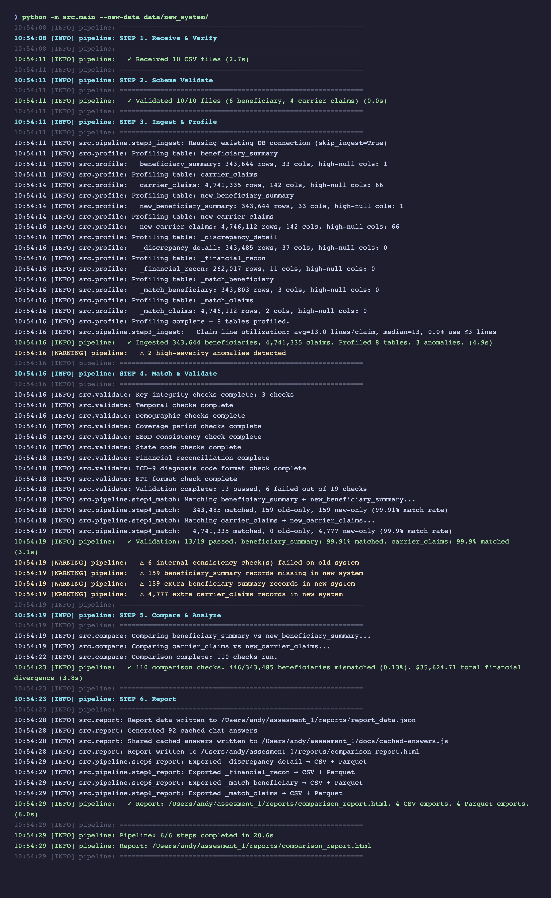

---

## 2. Test Suite

The project has **95 tests** across two categories:

- **62 unit/integration tests** — use synthetic data (in-memory DuckDB + temp files). No real data needed. Run in ~3 seconds.
- **33 real-data tests** — validate the actual CMS files (row counts, schemas, data quality, cross-system consistency). Auto-skipped if data is not present.

```bash
pytest tests/ -v
```

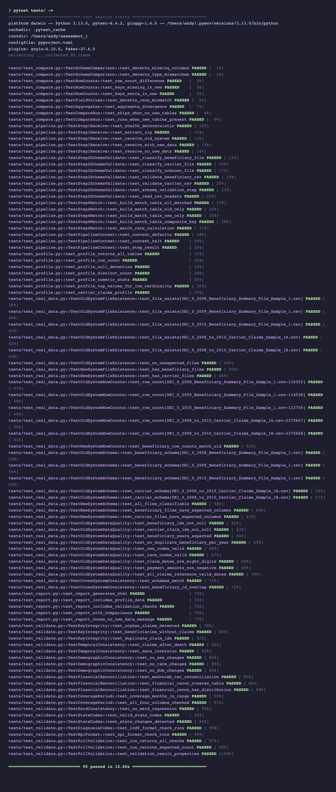

---

## 3. The Report

Start the local server first (interactive charts, Schema Explorer, SQL Explorer, and Parquet Viewer require HTTP):

```bash
./scripts/serve.sh        # http://localhost:8888
```

Then open http://localhost:8888/reports/comparison_report.html — this is the primary deliverable. It's designed for progressive disclosure: KPIs first, then narrative, then detailed charts, then raw data.

### Executive Summary

The top of the report shows key metrics at a glance: total beneficiaries, total claims, matched/unmatched counts, and pass/fail indicators for each validation category.

A reviewer should be able to answer "what's wrong and how bad is it" within 10 seconds of opening the report.

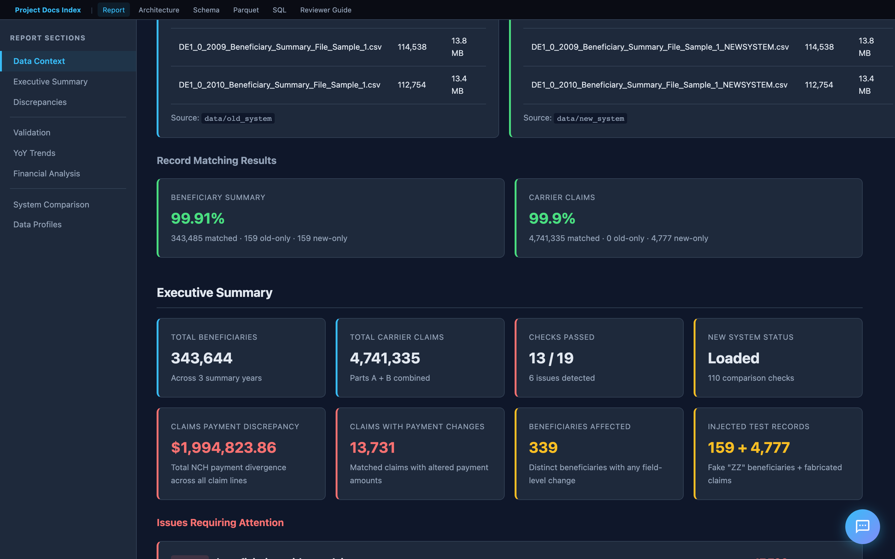

### Key Findings

Below the KPIs is an interpretive narrative — not just numbers, but what they mean. This includes root cause hypotheses, risk assessment, and a clear recommendation on whether the new system is ready for cutover.

This section demonstrates domain understanding: the analysis is informed by the CMS codebook, not just the data structure.

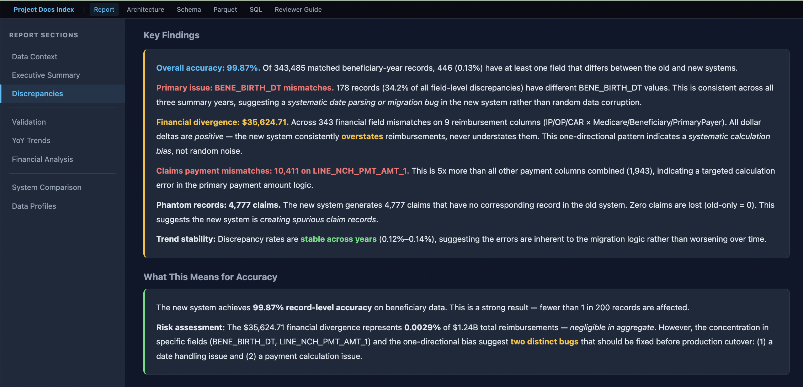

### Validation Results

Internal consistency checks on the old system data. The bar chart shows issues found per check across four categories:

| Category | What it checks |
|----------|---------------|
| **Identity** | Orphan claims, beneficiaries without claims, duplicate claim IDs |
| **Temporal** | Claims after death, date inversions (start > end) |
| **Demographic** | Sex/race/DOB changes across years for the same beneficiary |
| **Financial** | Carrier reimbursement reconciliation (MEDREIMB_CAR, BENRES_CAR, PPPYMT_CAR) |

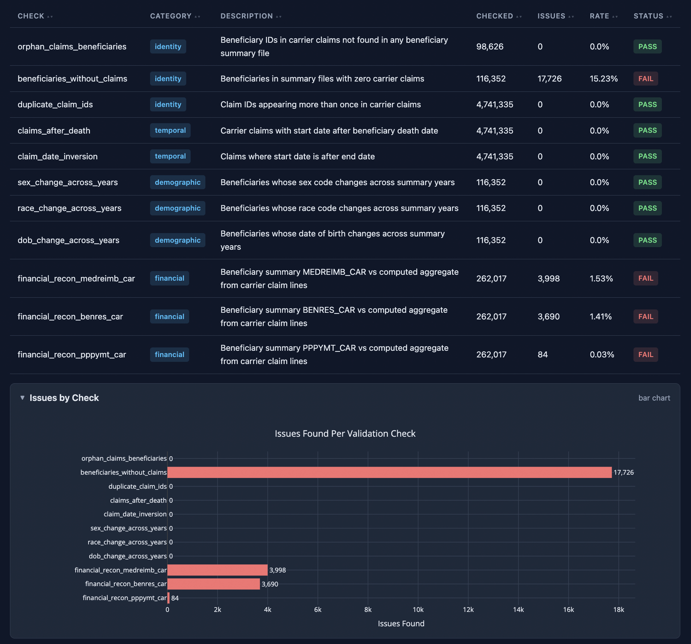

### Financial Reconciliation

The financial reconciliation section deserves special attention. It compares beneficiary summary reimbursement totals against the sum of individual claim line items — the logic is derived from the CMS codebook (filtering on `LINE_PRCSG_IND_CD` values, summing `LINE_NCH_PMT_AMT` across 13 line items per claim).

This directly addresses the assessment requirement: "Total number of Claims whose payments don't match."

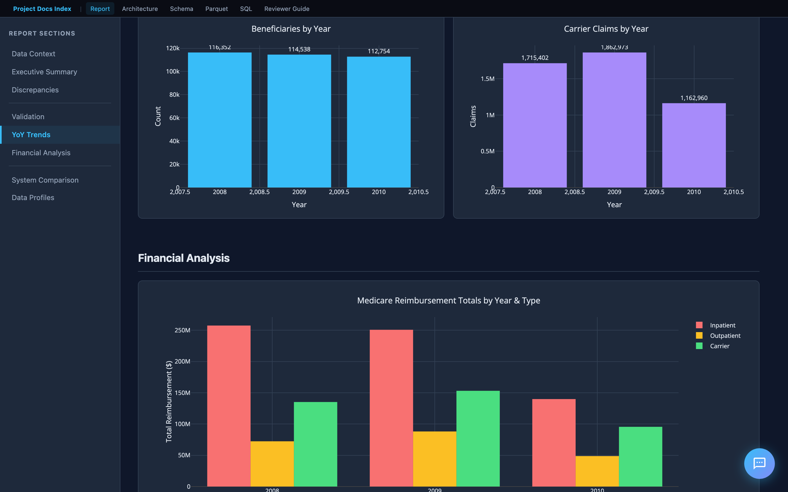

### System Comparison (Old vs New)

When new system data is loaded, the report adds a comparison dashboard:

- **Schema comparison** — missing/extra columns, type mismatches
- **Row-level diffs** — records in old but not new (and vice versa), matched by key
- **Field-level mismatches** — per-field value diffs on matched records
- **Aggregate divergence** — sum/mean differences in financial columns

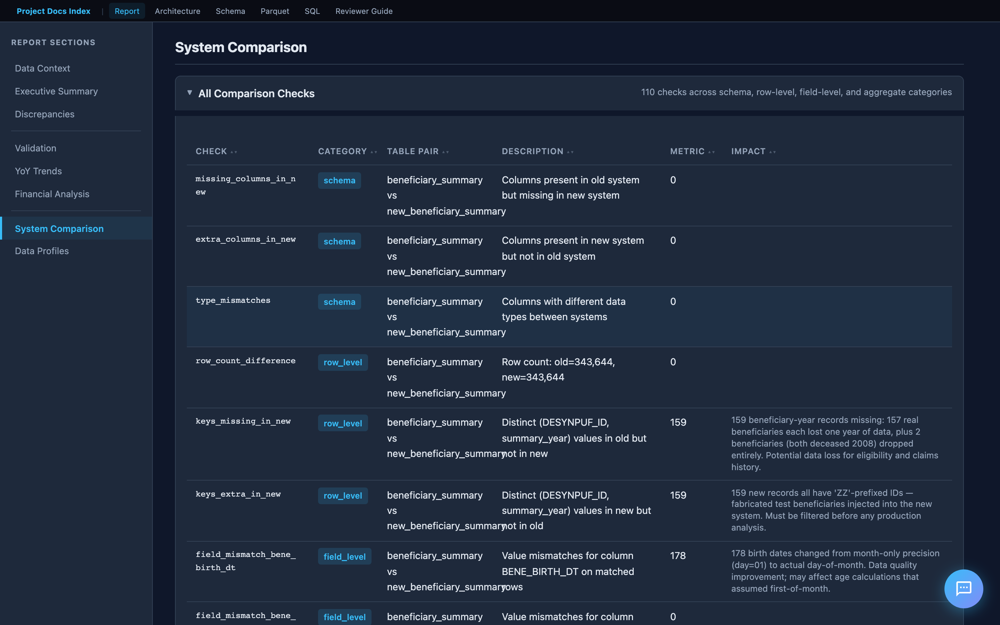

### Year-over-Year Trends

Interactive Plotly charts show how metrics change across 2008–2010. The assessment specifically asks to "identify any trends" — these charts surface patterns like increasing beneficiary attrition, financial drift, and seasonal claim volume shifts.

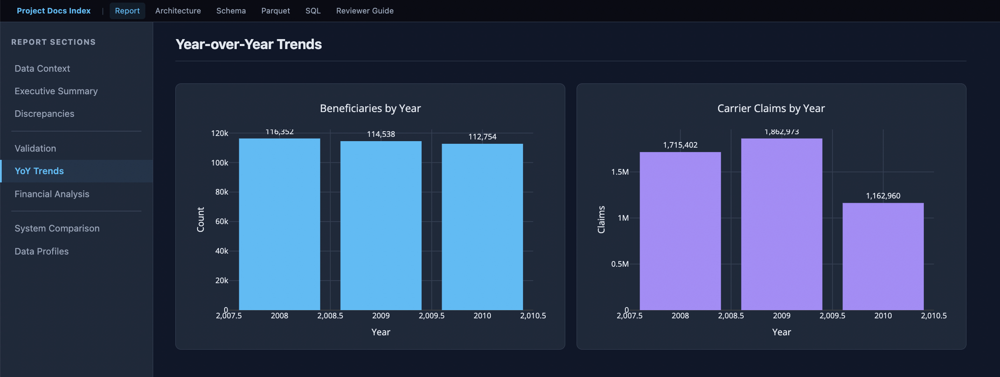

---

## 4. Documentation Hub

The project includes a documentation site with interactive tools and design documentation. When running via Docker, it's served at `http://localhost:8888`. Otherwise, open `docs/index.html` directly.

### Landing Page

The hub links to everything: the comparison report, interactive tools, design documentation, and CMS reference materials (codebook, FAQ, data users guide).

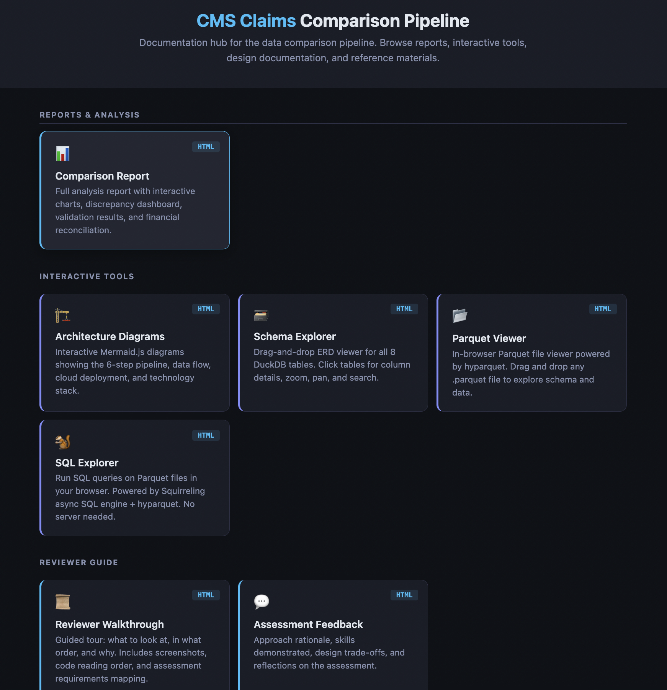

### Interactive Tools

The project includes several in-browser tools that require no server:

| Tool | What it does |
|------|-------------|
| **Schema Explorer** | Drag-and-drop ERD viewer for all DuckDB tables. Click for column details. |
| **Parquet Viewer** | In-browser Parquet file viewer (powered by hyparquet). Drag and drop any `.parquet` export. |
| **SQL Explorer** | Run SQL queries on Parquet files in the browser. No server needed. |
| **Architecture Diagrams** | Interactive Mermaid.js diagrams of the pipeline, data flow, and cloud deployment. |

### Schema Explorer

The ERD viewer renders all 8 DuckDB tables as draggable cards with column names, types, and foreign key relationships. Click any table to expand its full column details. Supports zoom, pan, and search.

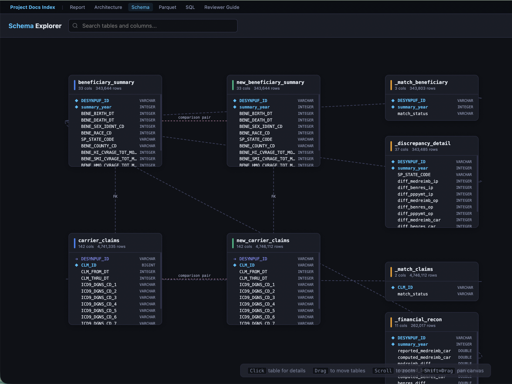

### SQL Explorer

A browser-based SQL query editor powered by Squirreling's async SQL engine + hyparquet. Load any exported Parquet file and run ad-hoc queries — no server or database connection required. Includes sample queries to get started.

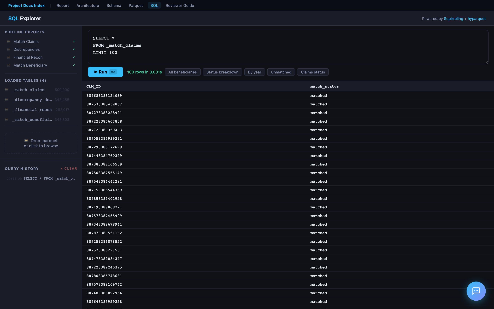

### Parquet Viewer

Drag and drop any `.parquet` file to instantly view its schema (column names, types, row count) and preview the first N rows in a formatted table. Powered by hyparquet for fully client-side parsing.

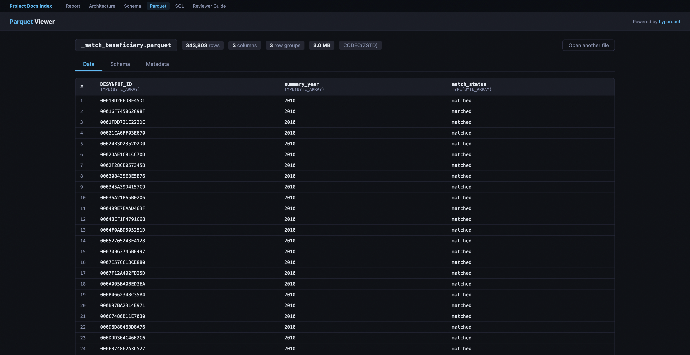

---

## Report Pal (AI Chat Assistant)

Every page in the hosted report includes **Report Pal** — an AI assistant that helps reviewers explore findings through natural conversation.

### How to Try It

1. Open the [hosted report](https://ddmmvtx76d1f8.cloudfront.net/reports/comparison_report.html)
2. Click the chat bubble in the bottom-right corner
3. Choose **Text** (type questions) or **Voice** (speak naturally via WebRTC)

### Text Mode

- Powered by GPT-4o with live DuckDB access — it writes and runs SQL to answer data questions
- Pre-cached answers for common questions (instant, no API call)
- SQL queries shown inline with copy-to-clipboard and "Open in SQL Explorer" links
- Suggested questions bar + autocomplete for quick exploration

### Voice Mode

- Powered by OpenAI Realtime API via WebRTC — full-duplex voice conversation
- AI speaks with OpenAI's **coral** voice; user speech transcribed via Whisper
- Stop button (🔇) in header bar immediately cancels AI voice mid-sentence
- No push-to-talk — server VAD detects when you start/stop speaking

### Cached Answers — How They Are Generated

Every page loads `docs/cached-answers.js` — **92 pre-built Q&A pairs** that provide instant responses without hitting the Lambda API.

**Authorship:** The answer text — the analytical narratives, conclusions, risk assessments, and Codebook references — was **authored by Cascade (AI pair programmer)** during development. Each answer is an f-string template in `src/chat_answers.py` where the prose is fixed and **~30 dynamic data points** from the pipeline results are interpolated at build time. So the answers are AI-authored analysis with real pipeline data — not raw AI generation at runtime, and not purely hand-written either.

**Generation flow:**

1. The pipeline runs all validation, comparison, and analysis checks
2. Step 6 (`src/report.py`) calls `generate_cached_answers()` from `src/chat_answers.py`
3. `chat_answers.py` extracts data points from pipeline results (match statistics, validation outcomes, trends, financial reconciliation, etc.)
4. These are interpolated into the AI-authored f-string templates — producing Markdown answers with tables, bullet points, and CMS references
5. Each answer is paired with relevant SQL queries (for the "Review SQL" button)
6. The output is serialized to `docs/cached-answers.js` and loaded on every page before `chat-widget.js`

**Question categories (organized by Bloom's Taxonomy level):**

| Level | Example | Count |
|-------|---------|-------|
| 6 — Create | "Draft a go/no-go recommendation for the system migration" | 5 |
| 5 — Evaluate | "Based on the Codebook, which discrepancies represent true data corruption?" | 5 |
| 4 — Analyze | "Why does the 0.90 payment ratio affect all claim lines uniformly?" | 4 |
| 3 — Understand | "Can you explain the coverage period validation?" | ~20 |
| 2 — Remember | "What does BENE_HMO_CVRAGE_TOT_MONS mean?" | ~7 |
| 1 — Retrieve | "Which validation checks failed?" | ~15 |

For anything not cached (or fuzzy match < 60%), the widget falls through to the Lambda API.

### Lambda & Backend Functions

Report Pal relies on two Lambda backends. The source code is proprietary — only the hardcoded Function URLs are present in `chat-widget.js`.

**1. Chat Lambda — Multi-Provider AI Proxy** (`LAMBDA_URL`)

Proxies user questions to AI models with full DuckDB database access. **Supports three providers** — switch models from the chat widget's config drawer (hover over the bottom bar):

| Provider | Models | Auth |
|----------|--------|------|
| **OpenAI** | GPT-4o (default), GPT-4o Mini | SSM API key |
| **OpenRouter** | Claude Sonnet 4, Gemini 2.0 Flash, Llama 3.3 70B | SSM API key |
| **AWS Bedrock** | Nova Pro, Nova Lite, Nova Micro | IAM role (no key) |

All providers share the same system prompt (`src/chat_prompt.py`), DuckDB database, and `query_database` tool (up to 5 rounds of SQL execution per question). OpenAI and OpenRouter use the OpenAI Python SDK (OpenRouter with a different `base_url`). Bedrock uses the `boto3` Converse API with the tool spec converted from OpenAI format.

The model selector persists your choice in `localStorage` — switch at any time, no setup required.

**2. Session Lambda — Voice Token Generator** (`SESSION_LAMBDA_URL`)

Thin proxy for WebRTC voice sessions — no data processing, no DuckDB:

1. Retrieves OpenAI API key from SSM
2. Calls OpenAI `/v1/realtime/sessions` → ephemeral token (expires 60 seconds)
3. Browser uses token to connect directly to **OpenAI Realtime API** (`gpt-4o-realtime-preview-2025-06-03`)
4. Voice session configured via `session.update`: condensed Report Pal prompt, `coral` voice, server-side VAD, `whisper-1` transcription

The Session Lambda source code is a standalone deployment (not in this repository).

### Security

- No API keys in the browser — all OpenAI calls go through Lambda backends
- Ephemeral tokens for voice mode expire after 60 seconds
- OpenAI API key stored in AWS SSM Parameter Store
- No credentials committed to the repository

---

## Code Reading Order

For reviewers who want to understand the code:

| Order | File | Lines | Why |
|-------|------|-------|-----|
| 1 | `README.md` | — | Entry point: Quick Start, architecture, project structure |
| 2 | `FEEDBACK.md` | — | Approach rationale, skills demonstrated |
| 3 | `src/pipeline/__init__.py` | ~50 | Defines `PipelineContext` and `StepResult` — the pipeline's data model |
| 4 | `src/pipeline/runner.py` | ~40 | The 6-step orchestrator with gate logic |
| 5 | `src/validate.py` | — | Deepest analytical work: financial reconciliation SQL, temporal checks |
| 6 | `src/compare.py` | — | Old-vs-new comparison engine |
| 7 | `src/report.py` | — | HTML report generation with Plotly charts |
| 8 | `src/chat_prompt.py` | ~130 | Shared Report Pal system prompt and OpenAI tool definitions |
| 9 | `docs/chat-widget.js` | ~1600 | Self-contained AI chat widget (text + WebRTC voice) |
| — | `docs/cached-answers.js` | (generated) | 92 pre-built Q&A pairs loaded on all pages (auto-generated by pipeline) |
| 10 | `tests/conftest.py` | ~160 | How test data is designed with intentional edge cases |
| 11 | `docs/SOLUTION.md` | — | Design decisions explained in prose |
| 12 | `docs/REQUIREMENTS_TRACEABILITY.md` | — | Maps every spec requirement to its implementation |

---

## Assessment Requirements Mapping

| Spec Requirement | Where to Find It |
|-----------------|-----------------|
| Ingest and clean the data | `src/ingest.py`, pipeline Step 3 |
| Build a simple ETL pipeline | 6-step pipeline (`src/pipeline/`), DuckDB (`data/database/`) |
| Identify and quantify discrepancies | Report: Validation Results, System Comparison |
| Identifiable trends | Report: Year-over-Year Trend Charts |
| Total number of Beneficiaries whose data does not match | Report: Executive Summary KPIs |
| Total number of Claims whose payments don't match | Report: Financial Reconciliation |
| Generate a report | `reports/comparison_report.html` — interactive HTML with charts |
| Source code | All in `src/`, `tests/`, `cloud/`, `infra/` |
| Screenshots | `screenshots/` directory |
| README.md | This file + `README.md` |
| FEEDBACK.md | `FEEDBACK.md` |

---

## Key Design Decisions

1. **DuckDB over Pandas** — SQL is clearer for the complex joins and aggregations in financial reconciliation. DuckDB handles the 2.4 GB carrier claims files without memory pressure and requires no server.

2. **6-step pipeline with gate logic** — each step is independently testable and can halt early. This mirrors production data pipeline design.

3. **Report for communication** — executive summary and failed checks upfront, interactive charts for trends, data profiles as reference material. Designed for both technical and non-technical audiences.

4. **Docker for portability** — `docker build && docker run` runs everything on any machine.

5. **95 tests** — 62 synthetic (no data needed) + 33 real-data validation. Tests cover every pipeline step and core module.

6. **Flexible file discovery** — the pipeline discovers CSVs by column headers, not filenames. Works with any of the 20 CMS DE-SynPUF samples without code changes.
